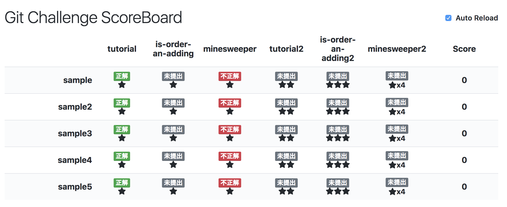

# git-plantation



## Requirement

- [Haskell Stack](https://docs.haskellstack.org/) : use to build application
- [Elm compiler](http://elm-lang.org/) : use to build scoreboard page
- Docker and docker-compose : optional, if run Drone on local
- [ngrok](https://ngrok.com/) : optional, if run Drone and app on local

## Usage

### 1. Write config file

ref. `example/config.yaml`

### 2. Create problem repository in team

using `git-plantation-tool`:

```
$ GH_TOKEN=XXX stack exec -- git-plantation-tool -c example/config.yaml --work .temp new_repo sample
```

### 3. Run app and drone

run app:

```
$ GH_TOKEN=XXX GH_SECRET=YYY stack exec -- git-plantation-app --port 8080 --work ".temp" --verbose example/config.yaml
```

run drone ci:

```
$ cd drone
$ docker-compose up
```

run ngrok:

```
$ ngrok start --config ngrok/config.yml app drone
```

setting ngrok URL in GitHub Webhook.

## Build with Docker

Define environment to `.env` from `.env.template`.

```
$ stack docker pull
$ stack build --docker
$ docker build -t git-plantation .
$ docker run --rm -it -v `pwd`:/work -p 8080:8080 --env-file .env git-plantation
```
